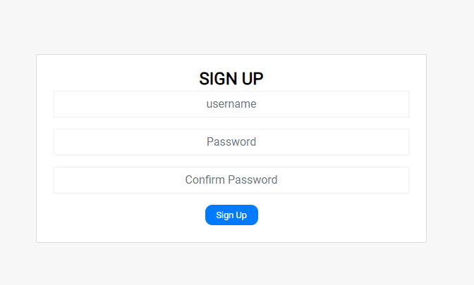
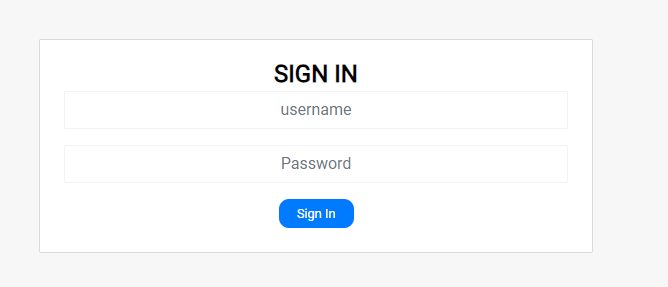
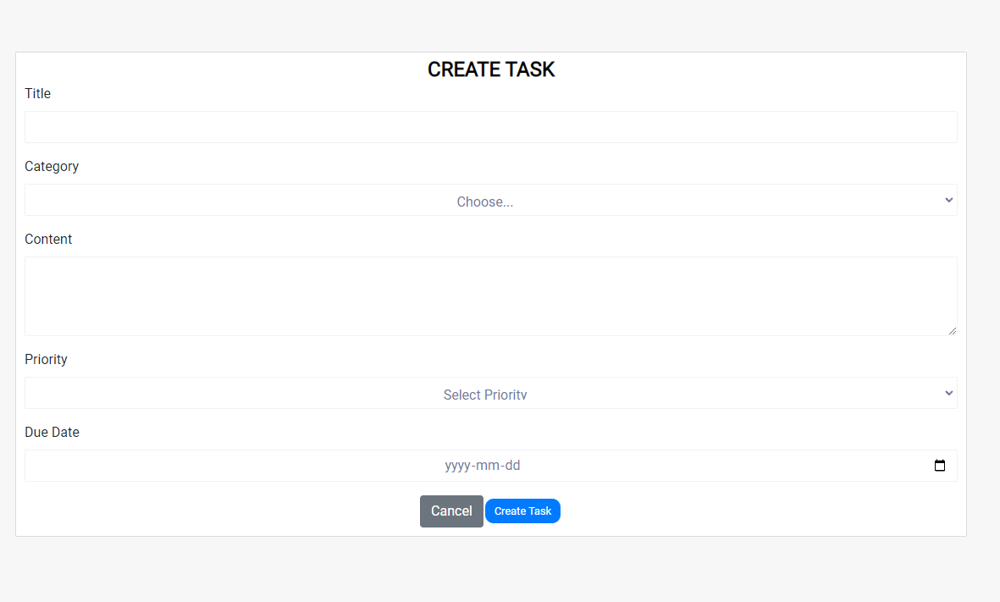
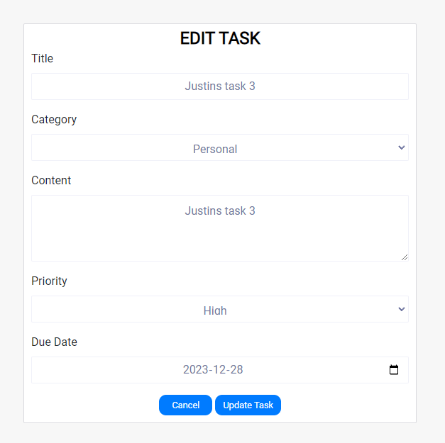
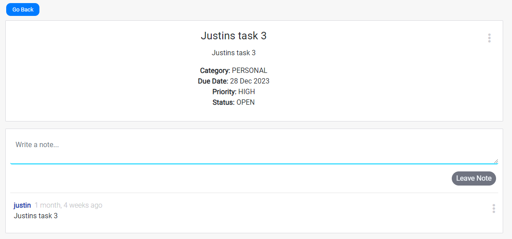
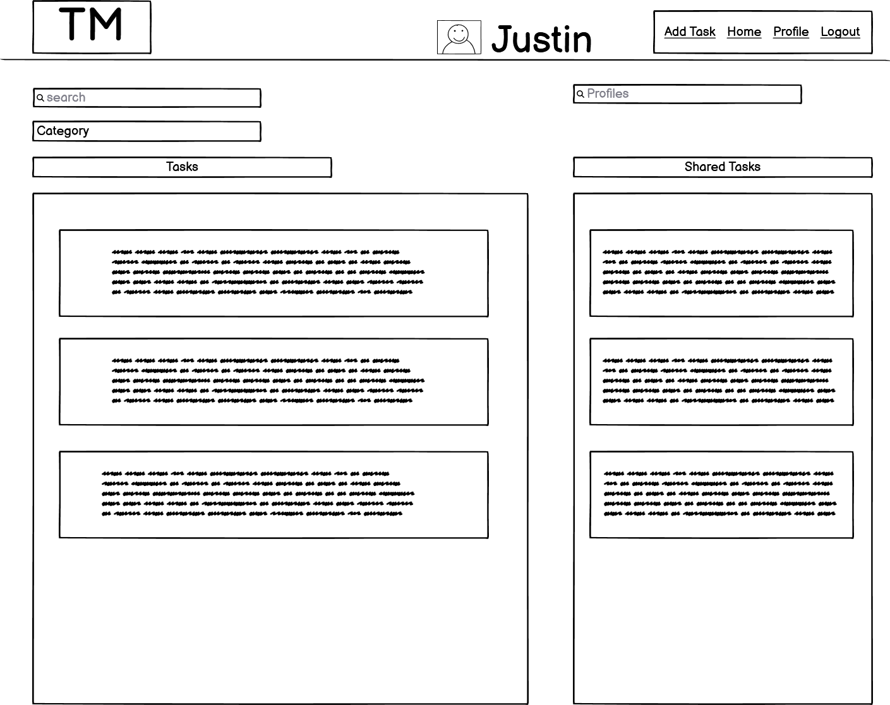
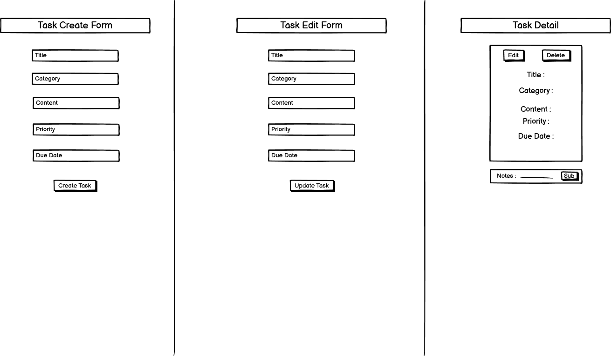

# Task Manager Application

Task Manager is a comprehensive web application designed to help users efficiently manage their tasks. It provides an intuitive interface for users to create, view, edit, and delete tasks, enhancing personal productivity and organization.

## Features

## Authentication


- The user is met by a form to either sign in if they have an account, otherwize a link to a sign up form is provided.

### Home Page

- A welcoming homepage that presents an overview of the application and its features.
- A user-friendly navigation bar for easy access to different sections of the app.


### Task Creation and Management





- Users can easily create/edit and delete tasks, specifying details such as title, category, description,priority and due date.
- Tasks are displayed in a clear and organized manner, allowing users to quickly scan their to-dos.

### Real-time Updates

- The system updates tasks in real-time, ensuring users always have the most current information.


### Responsive Design

- The application is fully responsive, providing an optimal experience on both desktop and mobile devices.


### Project Objectives

The Task Manager Application is designed with the primary goal of streamlining task management to boost personal and collaborative productivity. Key objectives of the project include:

- **Enhanced Task Management Efficiency**: The application provides a robust platform for users to effortlessly create, track, and update tasks. Features such as real-time updates, categorization, prioritization, and due date reminders are implemented to ensure that users can manage their tasks more effectively.

- **Intuitive User-Centric Design**: Emphasizing a user-first approach, the application boasts an intuitive interface. The UX/UI design ensures seamless navigation, accessibility, and a satisfying user experience. Responsive design ensures that the application is fully functional across various devices.

- **Collaboration and Sharing**: Recognizing the importance of teamwork and collaboration in task management, the application supports task sharing and collaboration features. This allows users to work together on shared tasks, improving efficiency and fostering a collaborative work environment.

- **Security and User Privacy**: With a secure authentication system and privacy controls, users can manage their tasks with confidence, knowing their data is protected.

- **Continuous Improvement**: The application is built with scalability in mind, open to future enhancements and integrations to meet evolving user needs and incorporate the latest technological advancements.

## UX Design Documentation

The Task Manager Application's design process was planned to ensure a seamless and intuitive user experience. This section outlines the key stages of the design process.

### Initial Concept and Wireframing

The design process began with brainstorming sessions to identify core functionalities and user needs. This led to the creation of initial wireframes, which served as blueprints for the application layout and interaction flow.

- **Home Page Wireframe**: Illustrated the layout of the homepage, including the navigation bar, task overview, and call-to-action buttons for creating new tasks, viewing profile, and adding friends.



- **Task Management Wireframe**: Showed the structure of the task creation and editing interfaces and detail views.



### Design Rationale

The design choices were guided by the principles of simplicity, intuitiveness, and efficiency:

- **Simplicity**: A clean and straightforward layout was chosen to minimize cognitive load and make the application easy to use.
- **Intuitiveness**: Familiar design patterns and clear visual cues were used to ensure users could naturally navigate the application.
- **Efficiency**: The task management process was streamlined, allowing users to create, edit, and organize tasks with minimal effort.

### Implementation

Apart from the functionality to view or add other profiles for collaboration, Most of the design concepts were translated into the application, ensuring that the final product closely aligned with the wireframes. 

## Features not yet Implemented

The Task Manager Application aims to enhance its collaboration capabilities with the introduction of several new features. These features are designed to foster teamwork, streamline communication, and facilitate shared task management among users. The following are key collaboration features that are planned for future implementation:

### Shared Task Lists

- **Description**: Allow users to create task lists that can be shared with and accessed by multiple users. This feature will enable teams to work on shared objectives and track progress collaboratively.
- **Benefit**: Facilitates teamwork by providing a shared space for task management, improving coordination and ensuring all team members are aligned on their goals and responsibilities.

### Real-time Task Updates and Notifications

- **Description**: Implement real-time updates for shared tasks, so any changes made by one user are instantly visible to all shared users. Additionally, introduce notification systems to alert users of updates, new tasks, or approaching deadlines.
- **Benefit**: Keeps team members informed of task progress and changes, enhancing transparency and ensuring timely responses to task updates.

## Testing

### Manual Testing

The Task Manager Application has undergone manual testing to ensure its functionalities meet the expected standards. The tests are categorized into Frontend and API testing.

### Frontend Testing

#### User Authentication

1. **User Registration**
   - **Procedure**: Navigate to the Sign Up page, fill in the required fields, and submit the form.
   - **Expected Result**: A new user account is created, and the user is redirected to the login page with a success message.

2. **User Login**
   - **Procedure**: Navigate to the Sign In page, enter valid credentials, and submit the form.
   - **Expected Result**: The user is authenticated and redirected to the homepage with a welcome message.

#### Task Management

3. **Task Creation**
   - **Procedure**: Click on 'Add Task', fill in the task details in the form, and submit.
   - **Expected Result**: A new task is added to the list, visible on the homepage.

4. **Task Editing**
   - **Procedure**: Click the edit icon on a task, modify the details, and submit the form.
   - **Expected Result**: The selected task is updated with the new details.

5. **Task Deletion**
   - **Procedure**: Click the delete icon on a task.
   - **Expected Result**: The selected task is removed from the list.

#### Navigation and Responsiveness

6. **Navigation**
   - **Procedure**: Use the navigation bar to move between different pages.
   - **Expected Result**: Navigation is smooth, and the correct page is displayed each time.

7. **Responsive Design**
   - **Procedure**: Access the application on different devices and browsers.
   - **Expected Result**: The application layout adjusts appropriately to the screen size and browser.

### API Testing

#### Authentication Endpoints

1. **Register Endpoint**
   - **Procedure**: Send a POST request to the `/dj-rest-auth/registration/` endpoint with a new user's details.
   - **Expected Result**: The API returns a 201 status code and the user details.

2. **Login Endpoint**
   - **Procedure**: Send a POST request to the `/dj-rest-auth/login/` endpoint with a user's credentials.
   - **Expected Result**: The API returns a 200 status code, user details, and an authentication token.

#### Task Endpoints

3. **Create Task Endpoint**
   - **Procedure**: Send a POST request to the `/tasks/` endpoint with the task details and a valid token.
   - **Expected Result**: The API returns a 201 status code and the created task details.

4. **Update Task Endpoint**
   - **Procedure**: Send a PUT request to the `/tasks/{id}/` endpoint with updated task details and a valid token.
   - **Expected Result**: The API returns a 200 status code and the updated task details.

5. **Delete Task Endpoint**
   - **Procedure**: Send a DELETE request to the `/tasks/{id}/` endpoint with a valid token.
   - **Expected Result**: The API returns a 204 status code, and the task is deleted.

All tests have been confirmed to have successful outcomes, ensuring the application's reliability and user satisfaction.

## Deployment

This section provides detailed instructions on how to deploy the Task Manager Application on Heroku and how to clone or fork the repository for local development or contributions.

### Deploying on Heroku

1. **Create a Heroku Account**: Sign up for a free account at [Heroku](https://signup.heroku.com/).
2. **Create a New Heroku App**: In your Heroku dashboard, click on the "New" button and select "Create new app". Provide a name for your app and select the region.
3. **Connect to GitHub**: In the "Deploy" tab of your app's dashboard, select "GitHub" as the deployment method. Connect your GitHub account and select the repository you wish to deploy.
4. **Set Environment Variables**: Go to the "Settings" tab in your app's dashboard. Click on "Reveal Config Vars" and add all the necessary environment variables such as `SECRET_KEY`, `DATABASE_URL`, and any other variables your application requires.
5. **Deploy**: Choose the branch you wish to deploy from and click on "Deploy Branch".

### Cloning and Forking the Repository

#### Forking the Repository

To fork the repository for contributions or personal modifications, follow these steps:

1. Navigate to the repository on GitHub at `https://github.com/JustinFourie1993/task-man`.
2. In the top-right corner of the page, click the **Fork** button.
3. This will create a copy of the repository in your GitHub account. You will be redirected to this new forked repository automatically.

After forking, you can clone the repository to your local machine to make changes:

#### Cloning the Repository

To clone the repository for local development:

* Run:
```bash
git clone https://github.com/JustinFourie1993/task-man.git
```
* Install dependencies and run your local server

## Frontend Libraries Usage

In the application, several frontend libraries are utilized to enhance functionality, improve user experience, and facilitate development. Below are the key libraries used, along with the justification for their inclusion:

### React

- **Usage**: Serves as the foundation of the application, enabling the creation of reusable UI components.
- **Justification**: React's component-based architecture offers an efficient way to build dynamic and interactive user interfaces. Its virtual DOM system optimizes rendering and improves app performance, making it ideal for high-performance applications.

### React Router DOM

- **Usage**: Manages navigation and routing within the application.
- **Justification**: React Router DOM enables the implementation of dynamic routing in a web app, which is crucial for single-page applications (SPAs) that require smooth user transitions between different views without full page reloads.

### Axios

- **Usage**: Handles HTTP requests to external APIs for data fetching, posting, updating, and deleting.
- **Justification**: Axios provides a straightforward way to work with asynchronous requests, including features like promise-based syntax, request and response interception, and automatic JSON data transformation, which simplifies handling API calls.

### Bootstrap & React-Bootstrap

- **Usage**: Used for styling, layout, and implementing responsive design with pre-defined components.
- **Justification**: Bootstrap's comprehensive CSS framework combined with React-Bootstrap components allows for rapid UI development with consistent styling. This accelerates the development process and ensures a mobile-friendly and accessible user interface.

### React Infinite Scroll Component

- **Usage**: Implements infinite scrolling functionality, loading content progressively as the user scrolls.
- **Justification**: Infinite scrolling enhances user experience in applications where large sets of data are displayed, such as social media feeds or content lists, by reducing initial load time and memory usage.

### JWT-Decode

- **Usage**: Decodes JWTs to extract user information on the client side.
- **Justification**: In applications utilizing JWT for authentication, jwt-decode is essential for parsing the token to obtain user details without needing to make additional API calls.

These libraries collectively form the backbone of the application, each chosen for its ability to meet specific requirements of the project efficiently. Their integration into the application supports a robust, maintainable, and user-friendly platform.

### React Architecture and Component Reuse

The Task Manager app is built on React's component-based architecture, promoting reusability and modularity. This structure allows for individual components to be developed, tested, and maintained independently. 
Key aspects of this architecture in the application include:

- **Modular Components**: Components like `NavBar`, `Task`, and `Note` are designed to be reusable across different parts of the application. For instance, the `NavBar` component adapts its content based on the user's authentication status, showcasing React's dynamic rendering capabilities.

- **Form Handling**: The application utilizes controlled components such as `TaskCreateForm` and `NoteCreateForm` to manage form states. This approach ensures a single source of truth for form data and allows for real-time validation feedback, enhancing the user experience.

- **State Management**: Using React's Context API (`CurrentUserContext`), the application manages global state efficiently. This eliminates prop drilling, making the code cleaner and more maintainable.

- **Custom Hooks**: The `useClickOutsideToggle` hook demonstrates encapsulating component behavior, making it reusable across different UI elements that require similar functionality, such as dropdowns and modals.

- **Integration with Third-Party Libraries**: The app integrates libraries like `react-bootstrap` for UI components and `react-infinite-scroll-component` for implementing infinite scrolling in the `TasksPage`. These libraries complement React's component model, adding complex functionalities without heavy lifting.

- **Responsive Design**: Leveraging Bootstrap alongside custom styles, components are built to be responsive and adapt to various screen sizes, ensuring a consistent user experience across devices.

By adhering to React's component-based architecture, the Task Manager app showcases how components can be reused and composed to build complex and dynamic web applications efficiently.
