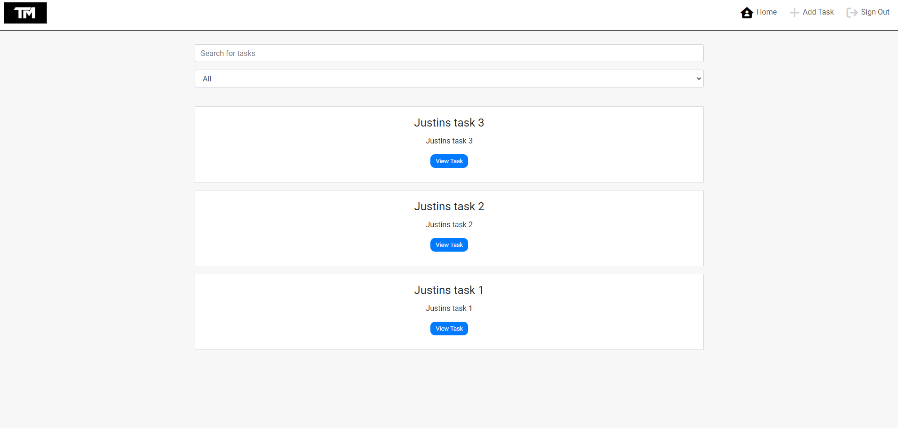
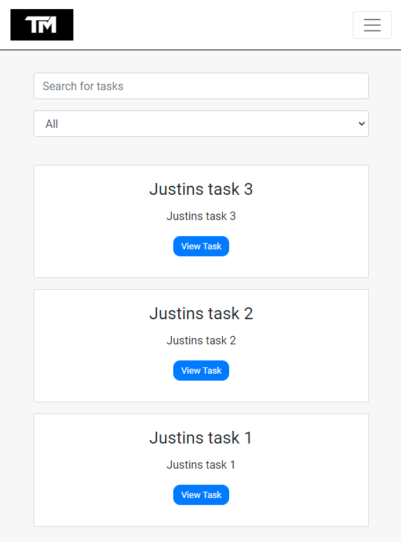

# Task Manager Application

Task Manager is a comprehensive web application designed to help users efficiently manage their tasks. It provides an intuitive interface for users to create, view, edit, and delete tasks, enhancing personal productivity and organization.

## Features

### Home Page

- A welcoming homepage that presents an overview of the application and its features.
- A user-friendly navigation bar for easy access to different sections of the app.



### Task Creation and Management

- Users can easily create new tasks, specifying details such as title, description, and due date.
- Tasks are displayed in a clear and organized manner, allowing users to quickly scan their to-dos.

### Real-time Updates

- The system updates tasks in real-time, ensuring users always have the most current information.


### Responsive Design

- The application is fully responsive, providing an optimal experience on both desktop and mobile devices.



## Testing

### Manual Testing

- **User Registration**: Tested the functionality of user account creation.
- **User Login**: Confirmed the login process with different user accounts.
- **Task Creation**: Validated the creation of tasks, ensuring they appear correctly for the user.
- **Task Editing**: Checked the ability to edit task details and verified changes are saved.
- **Task Deletion**: Ensured that tasks can be deleted and no longer appear in the user's list.
- **Responsive Design**: Tested the application on various devices to ensure a consistent and responsive layout.
- **Search Functionality**: Ensured that the task search feature works correctly, allowing users to find tasks based on keywords.
- **Data Persistence**: Verified that all task data remains persistent upon logging out and back into the application.
- **Error Handling**: Tested how the application handles incorrect inputs or invalid actions in task creation and editing.


### Project Objectives

- **Task Management Efficiency**: Aimed to create a user-friendly tool for managing daily tasks, enhancing personal productivity.
- **User-Centric Design**: Focused on a design that is intuitive and accessible for all users.


## Deployment

This section provides detailed instructions on how to deploy the Task Manager Application on Heroku and how to clone or fork the repository for local development or contributions.

### Deploying on Heroku

1. **Create a Heroku Account**: Sign up for a free account at [Heroku](https://signup.heroku.com/).
2. **Create a New Heroku App**: In your Heroku dashboard, click on the "New" button and select "Create new app". Provide a name for your app and select the region.
3. **Connect to GitHub**: In the "Deploy" tab of your app's dashboard, select "GitHub" as the deployment method. Connect your GitHub account and select the repository you wish to deploy.
4. **Set Environment Variables**: Go to the "Settings" tab in your app's dashboard. Click on "Reveal Config Vars" and add all the necessary environment variables such as `SECRET_KEY`, `DATABASE_URL`, and any other variables your application requires.
5. **Deploy**: Choose the branch you wish to deploy from and click on "Deploy Branch".

### Cloning and Forking the Repository

#### Forking the Repository

To fork the repository for contributions or personal modifications, follow these steps:

1. Navigate to the repository on GitHub at `https://github.com/JustinFourie1993/task-man`.
2. In the top-right corner of the page, click the **Fork** button.
3. This will create a copy of the repository in your GitHub account. You will be redirected to this new forked repository automatically.

After forking, you can clone the repository to your local machine to make changes:

#### Cloning the Repository

To clone the repository for local development:

* Run:
```bash
git clone https://github.com/JustinFourie1993/task-man.git
```
* Install dependencies and run your local server

## Frontend Libraries Usage

In the application, several frontend libraries are utilized to enhance functionality, improve user experience, and facilitate development. Below are the key libraries used, along with the justification for their inclusion:

### React

- **Usage**: Serves as the foundation of the application, enabling the creation of reusable UI components.
- **Justification**: React's component-based architecture offers an efficient way to build dynamic and interactive user interfaces. Its virtual DOM system optimizes rendering and improves app performance, making it ideal for high-performance applications.

### React Router DOM

- **Usage**: Manages navigation and routing within the application.
- **Justification**: React Router DOM enables the implementation of dynamic routing in a web app, which is crucial for single-page applications (SPAs) that require smooth user transitions between different views without full page reloads.

### Axios

- **Usage**: Handles HTTP requests to external APIs for data fetching, posting, updating, and deleting.
- **Justification**: Axios provides a straightforward way to work with asynchronous requests, including features like promise-based syntax, request and response interception, and automatic JSON data transformation, which simplifies handling API calls.

### Bootstrap & React-Bootstrap

- **Usage**: Used for styling, layout, and implementing responsive design with pre-defined components.
- **Justification**: Bootstrap's comprehensive CSS framework combined with React-Bootstrap components allows for rapid UI development with consistent styling. This accelerates the development process and ensures a mobile-friendly and accessible user interface.

### React Infinite Scroll Component

- **Usage**: Implements infinite scrolling functionality, loading content progressively as the user scrolls.
- **Justification**: Infinite scrolling enhances user experience in applications where large sets of data are displayed, such as social media feeds or content lists, by reducing initial load time and memory usage.

### JWT-Decode

- **Usage**: Decodes JWTs to extract user information on the client side.
- **Justification**: In applications utilizing JWT for authentication, jwt-decode is essential for parsing the token to obtain user details without needing to make additional API calls.

These libraries collectively form the backbone of the application, each chosen for its ability to meet specific requirements of the project efficiently. Their integration into the application supports a robust, maintainable, and user-friendly platform.

### React Architecture and Component Reuse

The Task Manager app is built on React's component-based architecture, promoting reusability and modularity. This structure allows for individual components to be developed, tested, and maintained independently. 
Key aspects of this architecture in the application include:

- **Modular Components**: Components like `NavBar`, `Task`, and `Note` are designed to be reusable across different parts of the application. For instance, the `NavBar` component adapts its content based on the user's authentication status, showcasing React's dynamic rendering capabilities.

- **Form Handling**: The application utilizes controlled components such as `TaskCreateForm` and `NoteCreateForm` to manage form states. This approach ensures a single source of truth for form data and allows for real-time validation feedback, enhancing the user experience.

- **State Management**: Using React's Context API (`CurrentUserContext`), the application manages global state efficiently. This eliminates prop drilling, making the code cleaner and more maintainable.

- **Custom Hooks**: The `useClickOutsideToggle` hook demonstrates encapsulating component behavior, making it reusable across different UI elements that require similar functionality, such as dropdowns and modals.

- **Integration with Third-Party Libraries**: The app integrates libraries like `react-bootstrap` for UI components and `react-infinite-scroll-component` for implementing infinite scrolling in the `TasksPage`. These libraries complement React's component model, adding complex functionalities without heavy lifting.

- **Responsive Design**: Leveraging Bootstrap alongside custom styles, components are built to be responsive and adapt to various screen sizes, ensuring a consistent user experience across devices.

By adhering to React's component-based architecture, the Task Manager app showcases how components can be reused and composed to build complex and dynamic web applications efficiently.
